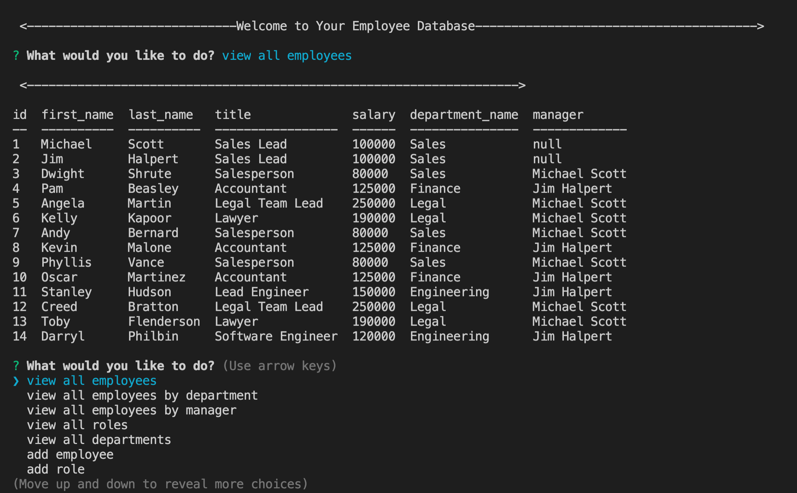

# Employee Database
      
    


## Description

This CLI app keeps track of important information needed to keep track of a team of employees. It allows the user to view all employees, view employees by department or manager, view all departments, and view all roles in the business along with each employee's salary. The user can also add or remove employees, roles, and departments, and update which role or manager an employee is assigned to. All information is stored in a database that is easily accessed or changed through the provided questions. This application utilizes MySQL, Node.js, Express.js, Console.table, and much more. The initial MySQL schema and seeds layouts are also provided to get up and running quickly.


​


​[Link to video of full functionality](https://drive.google.com/file/d/1GaYSxypTN3zwQbo9LJslmXWi4ypSkQxv/view)

## Table of Contents

* [Installation](#installation)
* [License](#license)
* [Questions](#questions)


## Installation

To install necessary dependencies, run the following command:

``` npm i ```

## Running

To start running the app, run the following command:

``` npm start ```


## License

This project is licensed under the APACHE 2.0 license.


## Questions

If you have any further questions, you can reach me directly here: lovins.jacob@yahoo.com

You can find more of my work at [https://github.com/jacoblovins/](https://github.com/jacoblovins/).